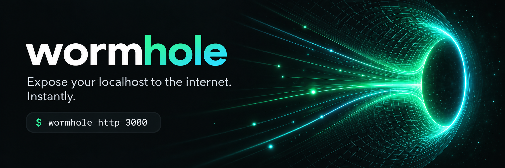
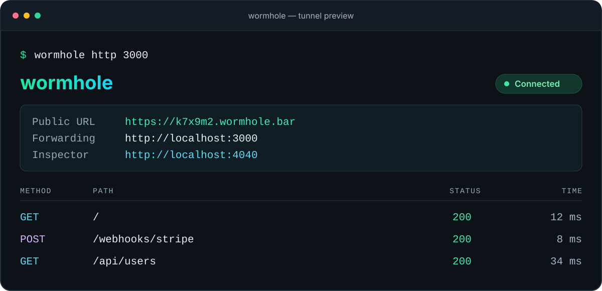
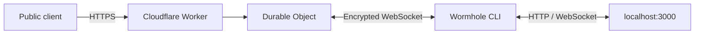

<p align="center">
  
</p>

<p align="center">
  <a href="https://github.com/MuhammadHananAsghar/wormhole/releases"></a>
  <a href="https://github.com/MuhammadHananAsghar/wormhole/blob/main/LICENSE"></a>
  <a href="https://goreportcard.com/report/github.com/MuhammadHananAsghar/wormhole"></a>
</p>

<p align="center">
  <a href="https://wormhole.bar">Website</a> ·
  <a href="#installation">Installation</a> ·
  <a href="#quick-start">Quick start</a> ·
  <a href="#cli-reference">CLI reference</a> ·
  <a href="https://github.com/MuhammadHananAsghar/wormhole/issues">Report an issue</a>
</p>

## Local development. Public URLs.

**Wormhole** gives your local server a public HTTPS URL with one command. Share a development server, test incoming webhooks, or preview an app on another device. Start a tunnel without an account or configuration file; sign in with GitHub when you need a custom subdomain.

```bash
wormhole http 3000
```

<p align="center">
  
  <br>
  <sub>Illustrative session · Your public URL is assigned when the tunnel connects.</sub>
</p>

## Features

| Capability | What you get |
| :--- | :--- |
| **Instant HTTPS tunnels** | A public URL for your local HTTP server, with TLS handled at the Cloudflare edge. |
| **Custom subdomains** | Request a memorable address after signing in with GitHub. |
| **Traffic inspector** | Inspect request and response details in a local dashboard with a live request stream. |
| **Replay and export** | Replay captured requests and export traffic in HAR format. |
| **WebSocket support** | Forward WebSocket connections through the tunnel. |
| **Automatic recovery** | Reconnect with exponential backoff when the connection drops. |
| **Terminal or headless mode** | Follow a color-coded request log or use plain log output. |
| **Open source** | A Go client and Cloudflare Workers relay, licensed under MIT. |

## Installation

### Quick install (macOS / Linux)

```bash
curl -fsSL https://wormhole.bar/install.sh | sh
```

### Homebrew (macOS)

```bash
brew install MuhammadHananAsghar/tap/wormhole
```

### Release binaries

Download a prebuilt binary from [GitHub Releases](https://github.com/MuhammadHananAsghar/wormhole/releases).

### Build from source

Requires Go 1.26.1 or later and Make.

```bash
git clone https://github.com/MuhammadHananAsghar/wormhole.git
cd wormhole
make build
# Binary: ./wormhole
```

## Quick start

### Expose a local HTTP server

```bash
# Start your local server on any port
wormhole http 3000
# => https://k7x9m2.wormhole.bar -> http://localhost:3000
```

### Custom subdomain (free)

```bash
# One-time login via GitHub
wormhole login

# Use your own subdomain
wormhole http 3000 --subdomain myapp
# => https://myapp.wormhole.bar -> http://localhost:3000
```

### Traffic inspector

Every tunnel automatically starts a traffic inspector at `http://localhost:4040`:

- Live request/response stream via WebSocket
- Request detail view with headers and body
- One-click request replay
- Filter by method, status code, path
- Export as HAR file

```bash
# Custom inspector port
wormhole http 3000 --inspect localhost:5050

# Disable inspector
wormhole http 3000 --no-inspect
```

## CLI reference

```bash
wormhole http <port>                    # Expose local HTTP server
wormhole http <port> --subdomain NAME   # Custom subdomain
wormhole http <port> --headless         # No TUI, plain log output
wormhole http <port> --inspect ADDR     # Custom inspector address
wormhole http <port> --no-inspect       # Disable inspector

wormhole login                          # Authenticate via GitHub
wormhole logout                         # Remove stored credentials
wormhole status                         # Show auth status
wormhole uninstall                      # Remove wormhole from system
wormhole uninstall --purge              # Also remove config (~/.wormhole/)
wormhole update                         # Update to the latest version
wormhole version                        # Print version
```

## How it works



1. The CLI opens a WebSocket connection to the Cloudflare edge and receives a public subdomain.
2. Requests to that subdomain reach a Worker, which routes them to the tunnel's Durable Object.
3. The Durable Object forwards requests over the connection to the CLI.
4. The CLI calls your local server and sends its response back through the tunnel.

The traffic inspector runs locally at `http://localhost:4040` and records requests for inspection, replay, and export.

## Architecture

| Component | Technology |
|---|---|
| CLI Client | Go, Cobra, Bubbletea, Lipgloss |
| Transport | WebSocket (gorilla/websocket) |
| Edge Relay | Cloudflare Workers + Durable Objects |
| Database | Cloudflare D1 (SQLite) |
| DNS | Cloudflare DNS (wildcard `*.wormhole.bar`) |
| TLS | Cloudflare automatic SSL |
| Auth | GitHub OAuth |

## Project structure

```
wormhole/
├── cmd/wormhole/          # CLI entry point
├── internal/
│   ├── client/            # Tunnel client (connect, forward, display)
│   ├── transport/         # WebSocket transport layer
│   └── inspect/           # Traffic inspector (recorder, server, replay, HAR)
├── edge/                  # Cloudflare Worker + Durable Object relay
│   ├── src/
│   │   ├── index.ts       # Worker router + auth
│   │   └── tunnel.ts      # Durable Object tunnel proxy
│   └── migrations/        # D1 schema migrations
├── pkg/config/            # User config (~/.wormhole/config.json)
├── deployments/           # install.sh, Docker, etc.
├── Makefile
└── .goreleaser.yml
```

## Security

Wormhole includes hardening measures to protect users who inadvertently expose sensitive local files or infrastructure details through the tunnel.

### Sensitive path blocking (CWE-441)

By default, wormhole blocks requests to dot segments and `node_modules` before they reach your local server. Matching is done after URL unescaping and path cleaning, so encoded or traversal variants are blocked too.

- `/.env`, `/.git`, `/.aws`, `/.ssh`, `/.docker`, and any other dot segment in the path: return **403 Forbidden**
- `/node_modules/` anywhere in the path: return **403 Forbidden**

This prevents credentials and source control history from being served to the internet even if your local server would normally serve them.

To disable (for users who genuinely need to serve these paths):

```bash
WORMHOLE_NO_PATH_FILTER=1 wormhole http 3000
```

### Inspector CORS hardening (CWE-942)

The traffic inspector (`localhost:4040`) does not set `Access-Control-Allow-Origin: *`. CORS headers are only returned when the request's `Origin` is a loopback origin on the inspector's bound port. This prevents malicious websites visited in the same browser session from reading tunnel traffic via cross-origin requests.

The WebSocket upgrader applies the same origin policy.

### Error message sanitization (CWE-200)

When the local server is unreachable, wormhole returns a generic message (`Tunnel connected, but the local service is not responding.`) to the remote caller instead of the raw Go error string. Internal network topology details (host names, port numbers, error codes) are logged locally only and never sent through the tunnel.

## Development

Use Go 1.26.1 or later for the client and Node.js with npm for the edge relay.

```bash
# Run all Go tests
go test ./... -race

# Run edge tests
(cd edge && npm ci && npm test)

# Build binary
make build

# Cross-compile all platforms
make dist
```

### Test-driven development

This project follows test-driven development. Write failing tests first, then implement.

```bash
# Run inspector tests without cached results
go test ./internal/inspect/ -v -count=1

# Coverage
go test ./... -cover
```

## Contributing

Bug reports and focused pull requests are welcome. For a bug report, include your operating system, `wormhole version`, reproduction steps, and relevant logs with credentials removed.

Before opening a pull request, run the tests for the components you changed. Update the documentation when changing commands or user-facing behavior.

## Roadmap

The current CLI uses a Cloudflare Workers relay. Future work includes a self-hosted Go relay, additional transports, and team features. The items below distinguish shipped capabilities from planned work.

<details>
<summary>View the development roadmap</summary>


- [x] **Phase 1** — Core tunnel (`wormhole http 3000` → public URL, WebSocket passthrough)
- [x] **Phase 2** — HTTPS, custom subdomains (auto-reserve, 3/user limit), GitHub OAuth
- [x] **Phase 3** — Traffic inspector, request replay, HAR export, curl generation
- [ ] **Phase 4** — Self-hosted Go relay (`wormhole server`, QUIC transport, SQLite persistence)
- [ ] **Phase 5** — Auth & multi-user (API keys, team tokens, CF + self-hosted middleware)
- [ ] **Phase 6** — Stream multiplexing (virtual streams over single WebSocket, backpressure)
- [ ] **Phase 7** — Plugin system (request/response pipeline, custom auth, transforms)
- [ ] **Phase 8** — Observability (Prometheus metrics, structured logs, health endpoints)
- [ ] **Phase 9** — Protocol evolution (version negotiation, TLS pinning, binary framing)
- [ ] **Phase 10** — Enterprise hardening (connection limits, mTLS, audit logs, RBAC)
- [ ] **Phase 11** — P2P mode (`wormhole share`, WebRTC direct connections, no relay)
- [ ] **Phase 12** — Polish & ship (homepage, docs site, video demos, package registries)

</details>

## Contributors

Thanks to everyone who helps improve Wormhole through code, documentation, bug reports, and ideas.

<a href="https://github.com/MuhammadHananAsghar/wormhole/graphs/contributors">
  
</a>

[View all contributors](https://github.com/MuhammadHananAsghar/wormhole/graphs/contributors) · [Contribute to Wormhole](#contributing)

## Author

**Muhammad Hanan Asghar**

- GitHub: [@MuhammadHananAsghar](https://github.com/MuhammadHananAsghar)
- LinkedIn: [muhammadhananasghar](https://www.linkedin.com/in/muhammadhananasghar/)

## License

MIT License. See [LICENSE](LICENSE) for details.

---

<p align="center">
  <sub>Built with Go + Cloudflare Workers. Runs on the edge.</sub>
</p>
